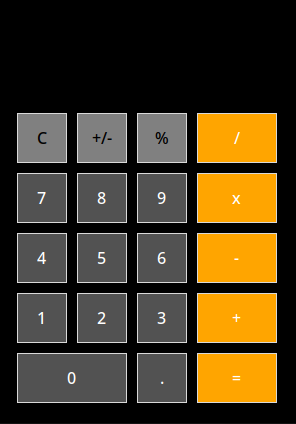

# A Simple Calculator on Tkinter, Python.

It is a simple calculator which written for school (pet-project). I know, it is dry, but I am beginner.

___

# How to install
`git clone https://github.com/Aratemori/tkCalculator .`
`cd tkCalculator`
`python main.py`
